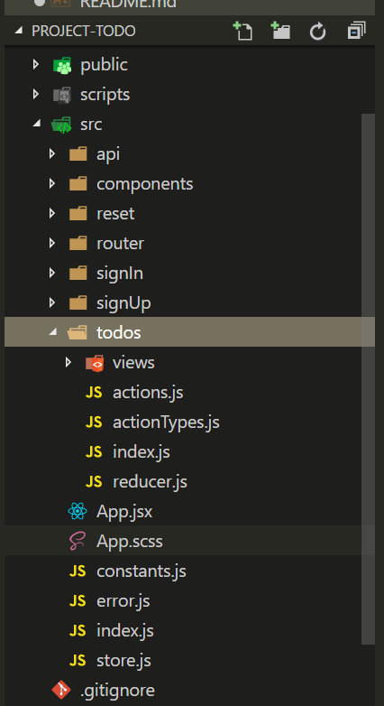
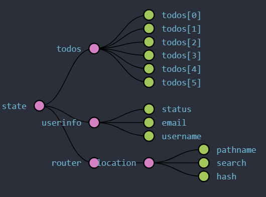
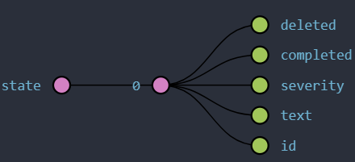

### 一个基于React 全家桶的 TodoList


*为了更好的学习React相关技术栈，才有这个项目。最初想使用localStorage来存储用户数据，但为了更好的体验，使用了LeanCloud提供的SDK服务*


#### 项目目标

1. 像素级还原UI图，实现主页、登录页、注册页、密码找回页等页面
2. 完成登录，注册，密码找回的功能
3. 完成ToDoList的增删改功能

#### 项目过程

* 确定项目结构。选择按功能组织的目录结构，也就是把完成同一应用功能的代码放在一个目录下。如下图
  
   

* store结构设计
  
   

 todo详情状态
  
   

* 使用create-react-app搭建环境，并添加sass文件支持，更改webpack配置文件。
  ```
    // 首先eject项目环境,此过程不可逆，慎用，此外官方也有相应的解决方案
    $ yarn eject
    // 添加loader
    $ yarn add node-sass sass-loader
  ```
  然后更改开发和生产配置文件，添加sass-loader

* 项目使用react-thunk中间件解决异步问题。
  *Redux的单项数据流是同步操作，没有执行异步操作的机会*
  > 驱动Redux的流程是action对象，每一个action对象被派发到Store上之后，同步地被分配给所有reducer函数，每个reducer都是纯函数，纯函数不产生任何副作用，自然是完成数据操作之后立刻同步返回，reducer返回的结果又被同步的去更新Store上的状态数据，更新状态数据的操作会立刻被同步给监听Store状态改变的函数，从而引发作为视图的React组件更新的过程

* 使用react-router4 进行路由设计，react-router4 的变化较大，还在进一步学习中，项目中只使用了几个简单设计。此外还使用react-router-redux。

    ```
     <ConnectedRouter history={history}>
        <div>
          <Route exact path="/todo" component={Todo}/>
          <Route  path="/signIn" component={SignIn}/>
          <Route  path="/signUp" component={SignUp}/>
          <Route  path="/reset" component={Reset}/>
        </div>
      </ConnectedRouter>   
    ```


#### 项目完成    
  
  [效果链接](https://zbhgit.github.io/MY-TODO/build)

此项目虽然不复杂，但从中学到了很多知识，如前端路由、使用中间件异步通信、Redux基本使用等等，后期会学习其实现原理，增加深层次的知识

#### 克隆DEMO到本地运行

```
$ git clone https://github.com/zbhgit/MY-TODO.git
$ cd MY-TODO
$ yarn install
$ yarn start
```
